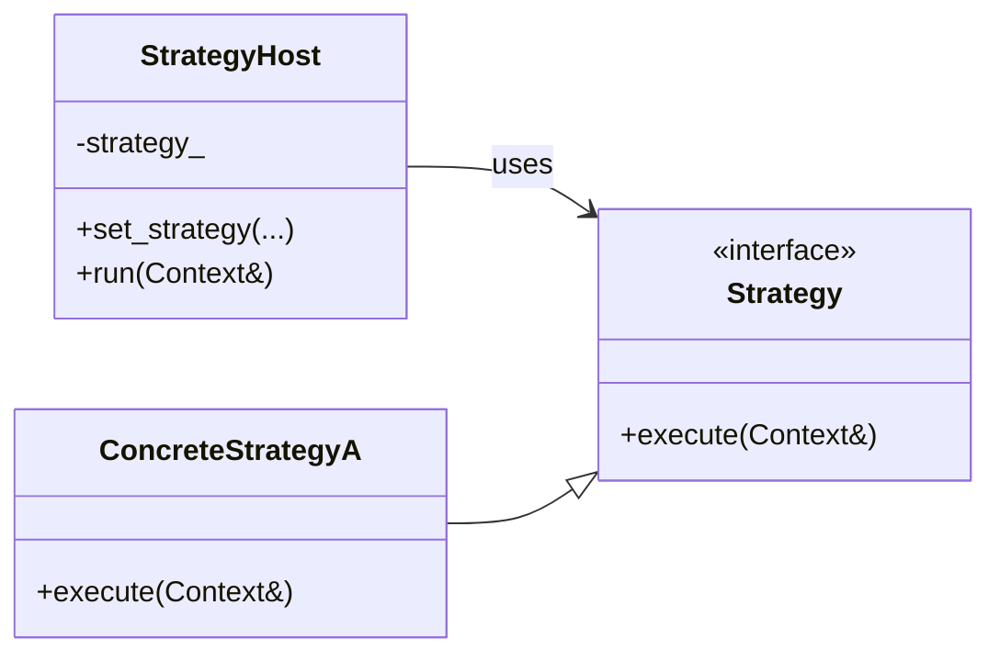
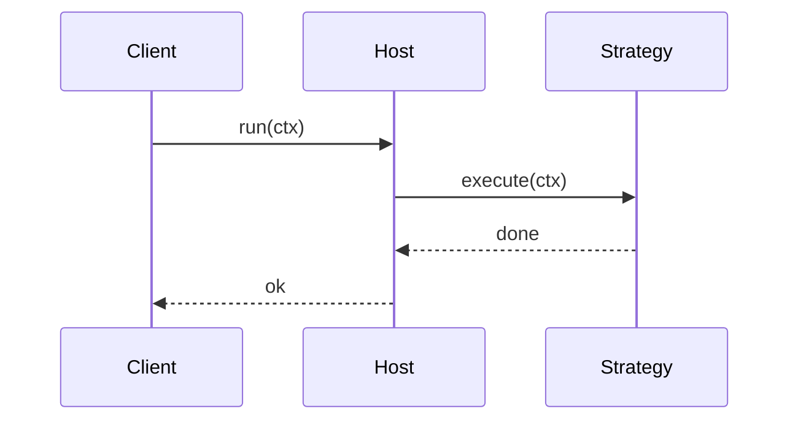
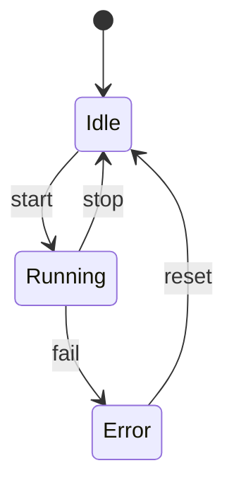

# How to write UML in Markdown (Mermaid)

MIR uses **Mermaid** diagrams inside `.md` files.  
GitHub, many IDEs, and most modern Markdown renderers display them natively.

## Basic recipe

1. Open a fenced code block with the language tag `mermaid`
2. Write the diagram
3. Close the fence

```markdown
​```mermaid
classDiagram
    class Foo
​```
```

## Class diagrams (most common for GoF)



### Useful class-diagram keywords

| Keyword | Meaning |
|---------|---------|
| `<<interface>>` | stereotype |
| `--\|>` | inheritance |
| `-->` | association / uses |
| `..>` | dependency |
| `*--` | composition |
| `o--` | aggregation |
| `+` / `-` / `#` | public / private / protected |
| `direction LR` / `TB` | left-right / top-bottom |

## Sequence diagrams (interactions)



## State diagrams



## Tips for MIR docs

- Put one diagram per logical unit (one pattern, one station, one interaction).
- Keep names identical to the C++ headers (`Strategy`, `StateContext`, …).
- Prefer `classDiagram` for structure, `sequenceDiagram` for runtime flow.
- File location convention: `docs/uml/<topic>.md`
- Tutorial location: `docs/tutor/markdown/`

## Where it renders

- GitHub (native)
- VS Code / Cursor (Markdown preview + Mermaid extension)
- Many static-site generators
- Notion, Obsidian, etc. (with plugins)

## References

- Mermaid live editor: https://mermaid.live
- Mermaid class diagram docs: https://mermaid.js.org/syntax/classDiagram.html
