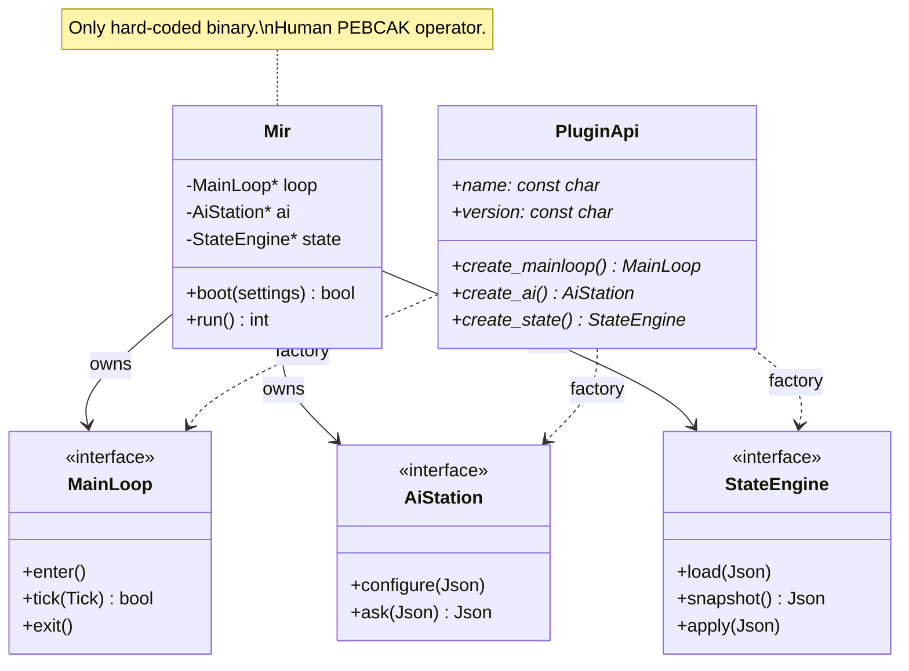
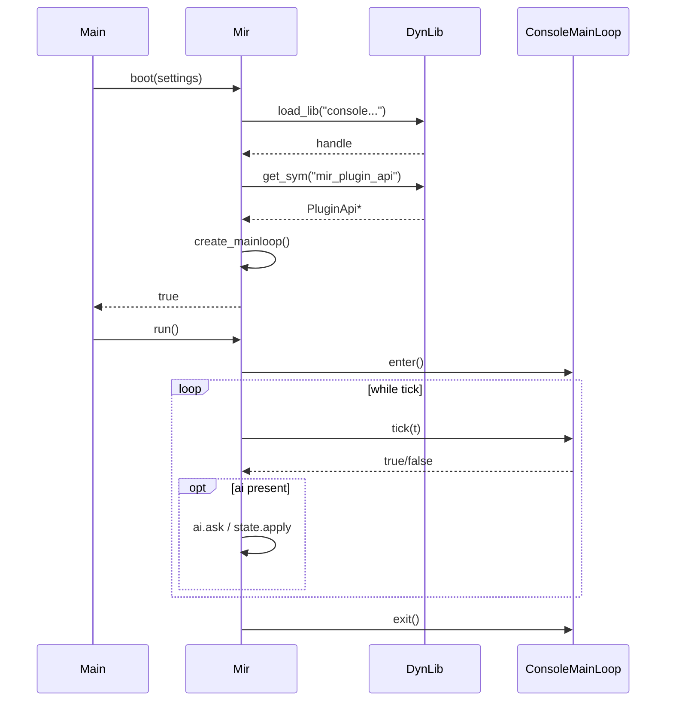

# UML — Core Stations (Mermaid)

```mermaid
classDiagram
    direction TB

    class Mir {
        -MainLoop* loop
        -AiStation* ai
        -StateEngine* state
        +boot(settings) bool
        +run() int
    }

    class MainLoop {
        <<interface>>
        +enter()
        +tick(Tick) bool
        +exit()
    }

    class AiStation {
        <<interface>>
        +configure(Json)
        +ask(Json) Json
    }

    class StateEngine {
        <<interface>>
        +load(Json)
        +snapshot() Json
        +apply(Json)
    }

    class PluginApi {
        +name: const char*
        +version: const char*
        +create_mainloop() MainLoop*
        +create_ai() AiStation*
        +create_state() StateEngine*
    }

    Mir --> MainLoop : owns
    Mir --> AiStation : owns
    Mir --> StateEngine : owns
    PluginApi ..> MainLoop : factory
    PluginApi ..> AiStation : factory
    PluginApi ..> StateEngine : factory

    note for Mir "Only hard-coded binary.\nHuman PEBCAK operator."
```

## Sequence (boot + run)

```mermaid
sequenceDiagram
    participant Main
    participant Mir
    participant DynLib
    participant Console as ConsoleMainLoop

    Main->>Mir: boot(settings)
    Mir->>DynLib: load_lib("console...")
    DynLib-->>Mir: handle
    Mir->>DynLib: get_sym("mir_plugin_api")
    DynLib-->>Mir: PluginApi*
    Mir->>Mir: create_mainloop()
    Mir-->>Main: true

    Main->>Mir: run()
    Mir->>Console: enter()
    loop while tick
        Mir->>Console: tick(t)
        Console-->>Mir: true/false
        opt ai present
            Mir->>Mir: ai.ask / state.apply
        end
    end
    Mir->>Console: exit()
```
