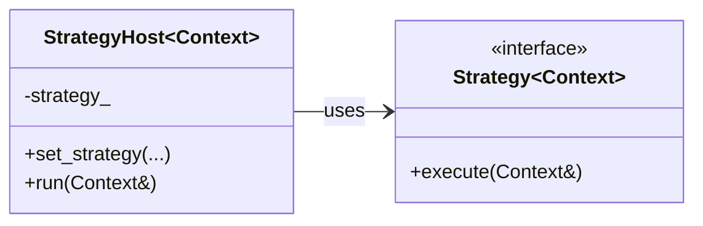
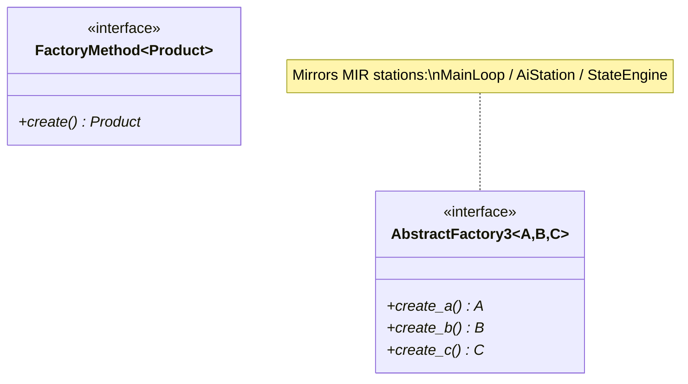
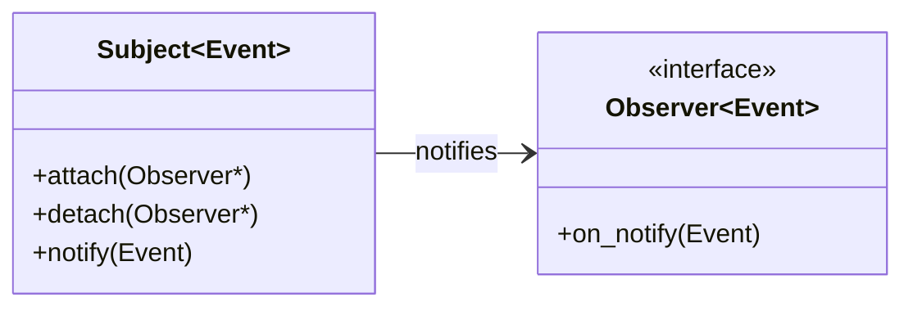
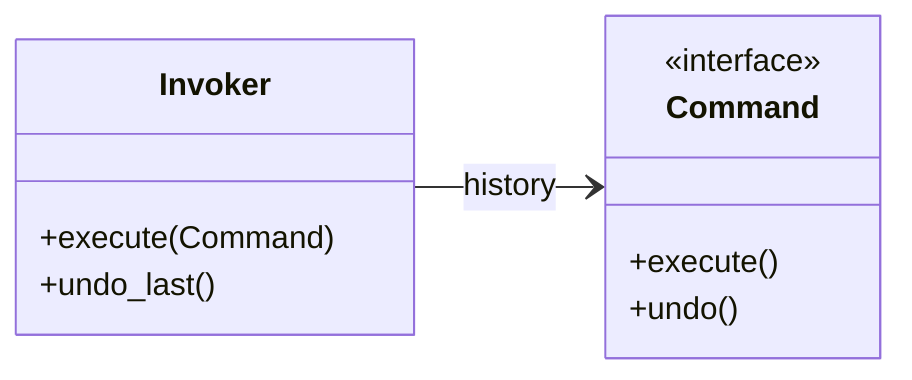
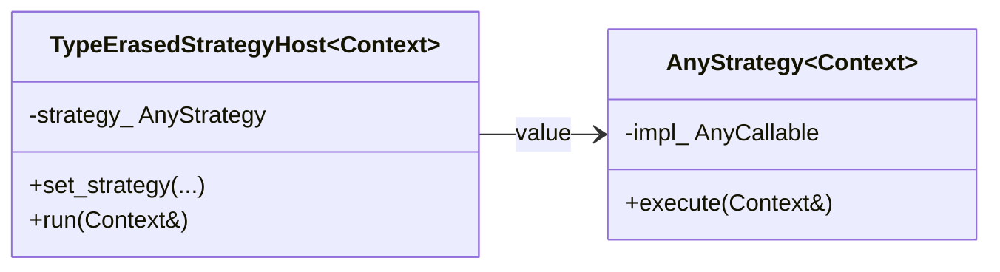

# UML — Core GoF Patterns (MIR)

## Strategy (raw + spartan)

```mermaid
classDiagram
    direction LR
    class Strategy~Context~ {
        <<interface>>
        +execute(Context&)
    }
    class StrategyHost~Context~ {
        -strategy_
        +set_strategy(...)
        +run(Context&)
    }
    StrategyHost --> Strategy : uses
```

## Factory Method / Abstract Factory

```mermaid
classDiagram
    direction TB
    class FactoryMethod~Product~ {
        <<interface>>
        +create() Product*
    }
    class AbstractFactory3~A,B,C~ {
        <<interface>>
        +create_a() A*
        +create_b() B*
        +create_c() C*
    }
    note for AbstractFactory3 "Mirrors MIR stations:\nMainLoop / AiStation / StateEngine"
```

## Observer

```mermaid
classDiagram
    direction LR
    class Observer~Event~ {
        <<interface>>
        +on_notify(Event)
    }
    class Subject~Event~ {
        +attach(Observer*)
        +detach(Observer*)
        +notify(Event)
    }
    Subject --> Observer : notifies
```

## Command

```mermaid
classDiagram
    direction LR
    class Command {
        <<interface>>
        +execute()
        +undo()
    }
    class Invoker {
        +execute(Command)
        +undo_last()
    }
    Invoker --> Command : history
```

## Type-Erased Strategy (advanced)

```mermaid
classDiagram
    direction LR
    class AnyStrategy~Context~ {
        -impl_ AnyCallable
        +execute(Context&)
    }
    class TypeErasedStrategyHost~Context~ {
        -strategy_ AnyStrategy
        +set_strategy(...)
        +run(Context&)
    }
    TypeErasedStrategyHost --> AnyStrategy : value
```
