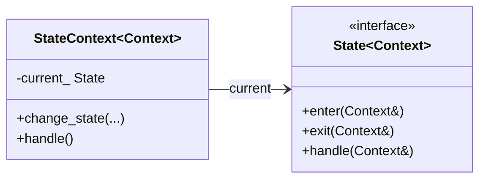
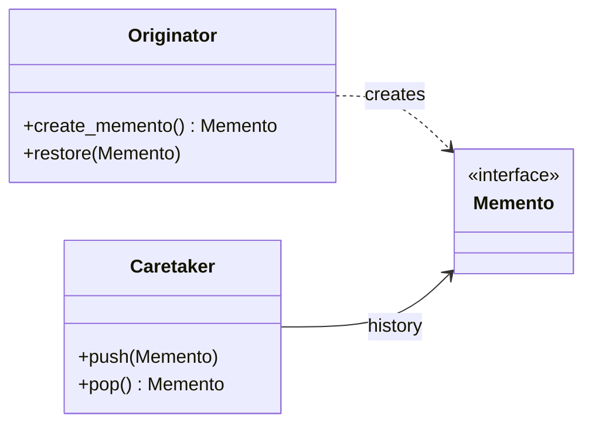
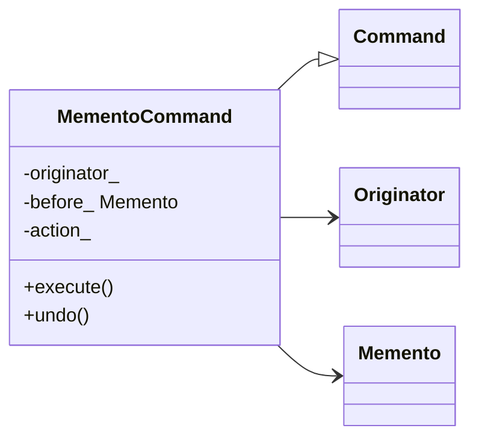
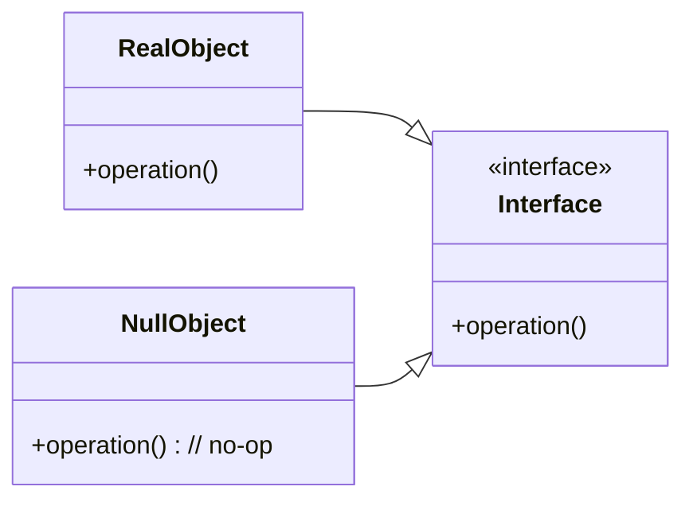
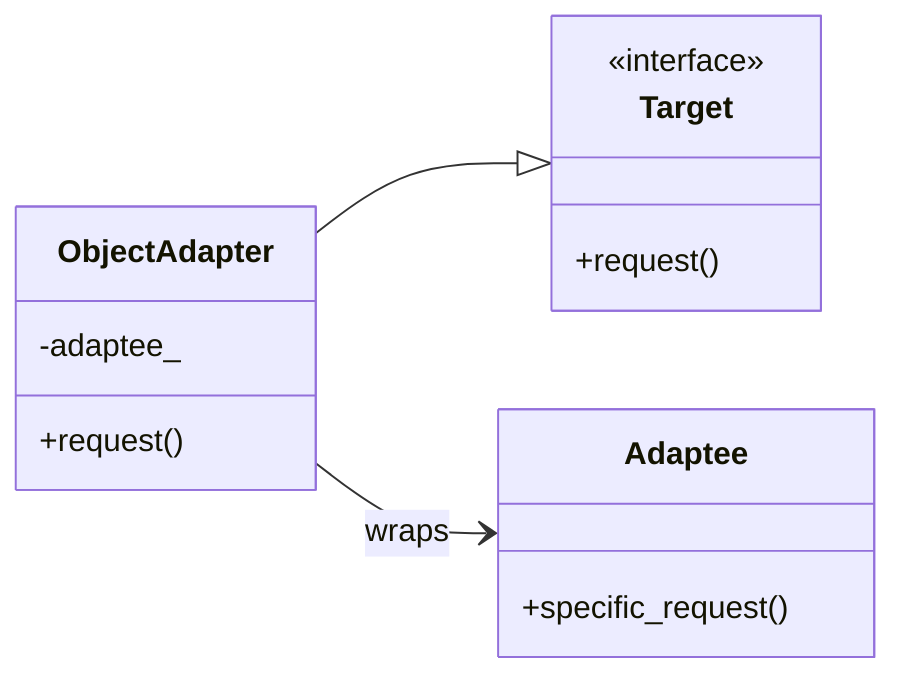
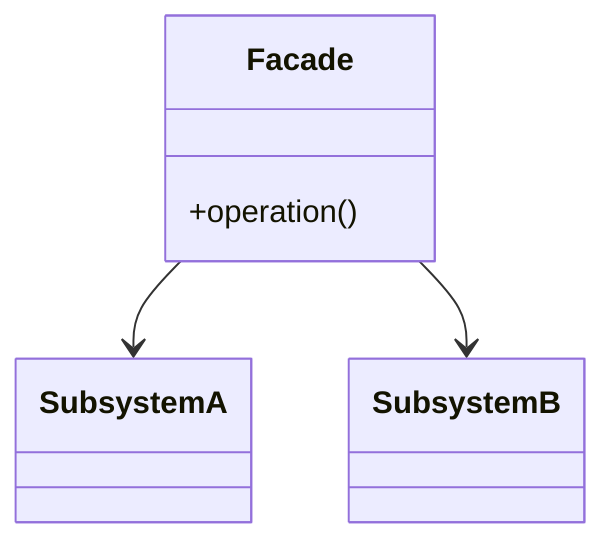
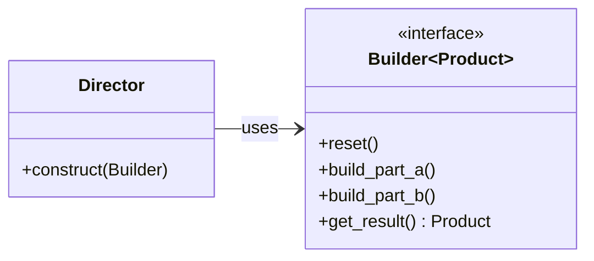

# UML — Wave 2 Patterns (State, Memento, Null Object, Adapter, Facade, Builder)

## State

## Memento + Caretaker

## Command + Memento (advanced)

## Null Object

## Adapter (Object)

## Facade

## Builder

