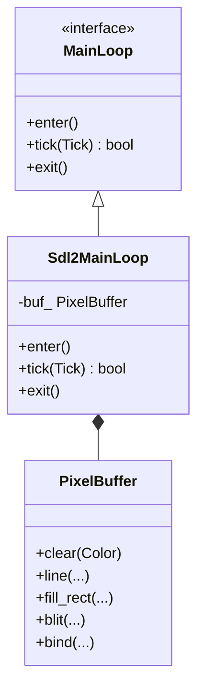

# UML — Graphic path (SDL2 + PixelBuffer)

```mermaid
classDiagram
    direction TB
    class MainLoop {
        <<interface>>
        +enter()
        +tick(Tick) bool
        +exit()
    }
    class Sdl2MainLoop {
        -buf_ PixelBuffer
        +enter()
        +tick(Tick) bool
        +exit()
    }
    class PixelBuffer {
        +clear(Color)
        +line(...)
        +fill_rect(...)
        +blit(...)
        +bind(...)
    }
    MainLoop <|-- Sdl2MainLoop
    Sdl2MainLoop *-- PixelBuffer
```
